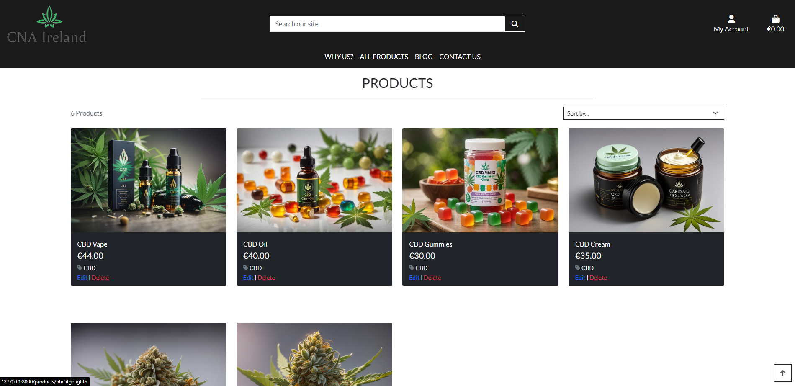
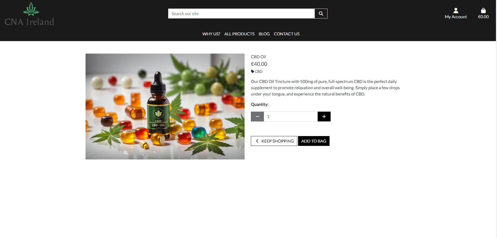
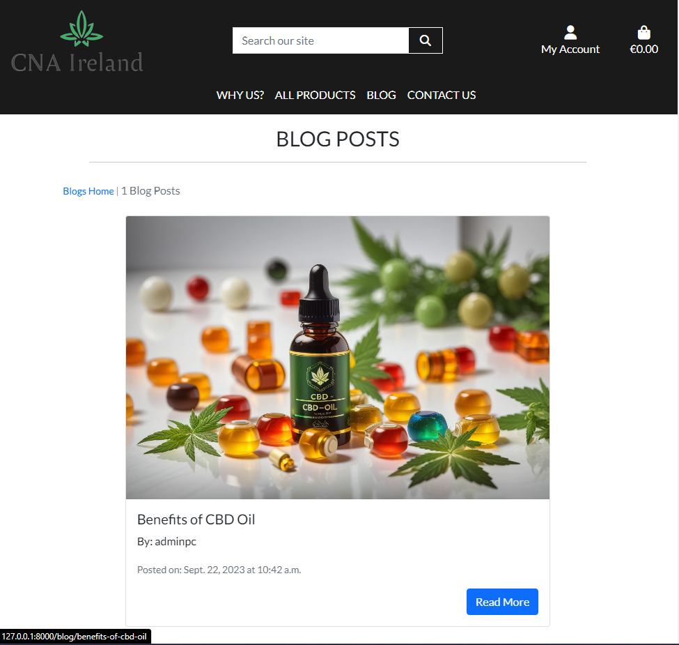
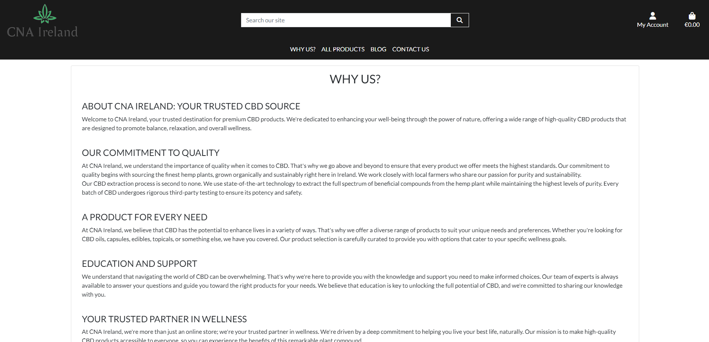
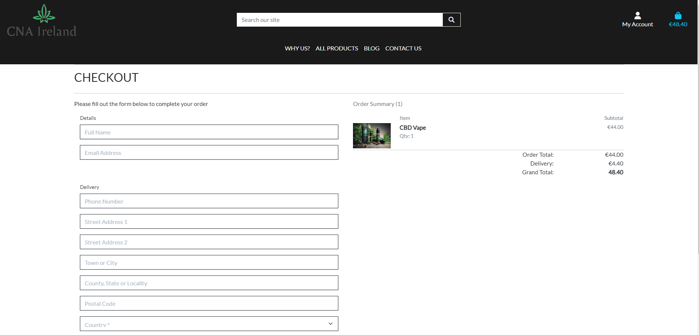
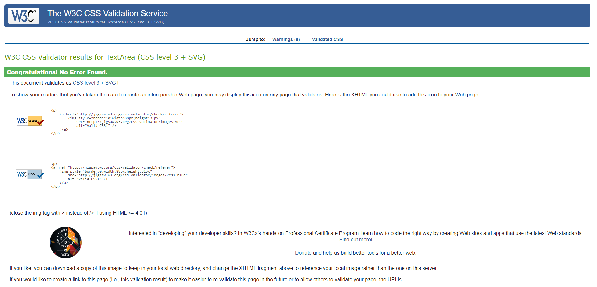

# CNA Ireland
This is an E-Commerce website I made for a fictional business that will be selling CBD Products and sharing blog posts related to CBD and its benefits. The main purpose is to get customers thinking about and considering about alternative health routes that holistic and not modern medicine for lack of a better term.

The website can be viewed here. [CNA Ireland](https://cnaireland-6f6c57542d6c.herokuapp.com/)

# Index - Table of Contents

- [User Experience (UX)](https://github.com/ShaneCDev/cna-ireland#user-experience-ux)
- [Features](https://github.com/ShaneCDev/cna-ireland#features)
- [Technologies Used](https://github.com/ShaneCDev/cna-ireland#technologies-used)
- [Testing](https://github.com/ShaneCDev/cna-ireland#testing)
- [Deployment](https://github.com/ShaneCDev/cna-ireland#deployment)
- [Credits](https://github.com/ShaneCDev/cna-ireland#credits)
- [Acknowledgments](https://github.com/ShaneCDev/cna-ireland#acknowledgments)

# User Experience (UX)

## User Stories

- ## As a website owner I want:
1. The website allows users to purchase products that are listed on the webstore.
2. The website gives users a great experience while they are visting the site.
3. The website allows users buy products as either a registered user or a guest.
4. The website allows users to check their order history.
5. The website allows users to save their profile data for faster checkouts should they use the site in the future.

- ## As a website user I want:
1. To view and search for products.
2. To filter products based on criteria.
3. To be able to create an account.
4. To be able to edit profile data.
5. To be able to add products to the shopping bag and make purchases.
6. Contact the site owner/customer service.

- ## As a returning website user I want:
1. To check out other people's product reviews.
2. Leave reviews on products.
3. Change my review and review score if my opinion should change.
4. Log into my account and view my orders.
5. Log into my account and change delivery details should it be required.
 

# 1. Business Model
## FaceBook Page
- [CNA Ireland Facebook Page](https://www.facebook.com/profile.php?id=61555181135854)

## Value Proposition
- Quality CBD Products: Offer a curated selection of high-quality CBD products, ensuring potency and safety.
- Convenience: Provide easy access to Cbd products through an intuitive and secure e-commerce platform.
- Educational Content: Offer informative resources about CBD benefits, usage and general information via blog posts.
## Customer Segments
- Health-Conscious Individuals: People seeking an holistic approach to various health issues.
- Fitness Entusiasts: Athletes and fitness oriented individuals looking for recovery and wellness aids.
## Key Activities
- Product Management: Source and curate a range of reputable CBD Products.
- Website Management: Develop and maintain a user friendly e-commerce platform.
- Customer Service: Provide responsive support regarding inquiries and assitance.
## Key Resources
- E-commerce Platform: User friendly website for product showcasing and selling.
- Product Suppliers: Establish long-lasting partnerships with reliable suppliers.
- Educational Content: Create informative content regarding CBD.
## Customer Relationships
- Online Support: Provide responsive customer service via email or whatsapp.
- Newsletter/Updates: Newsletters will be sent out to all subscribers every quarter.
- Educational Content: Offer blogs posts about CBD and its benefits.
## Revenue Streams
- Product Sales: Income generated from products sold on the website.
## Cost Structure
- Product Procurement Costs: Expenses that are associated with sourcing and purchasing the products.
- Website Maintenance: Costs for hosting, platform maintenance, potential scalability.
- Marketing Expenses: Budget for digital campaigns, advertising and content creation.
## Key Metrics
- Sales Revenue: Track income generated from product sales.
- Website Traffic: Measure the number of visitors to the site.
- Conversion Rate: Monitor the percentage of visitors that make a purchase.
- Customer Retention Rate: Assess how many customers return for repeated purchases. 
# 2. Strategy
- The main purpose of the site is to provide people with place to purchase CBD products whether it be for medical reasons or recreational ones.

# 3. Scope
- The multipage design is simple and the information provided is clear and concise.
- The information can be accessed on all devices.

# 4. Structure
- Users will find themselves on the homepage where they will be met by a background image and a "Shop Now" button and clicking this button will take users to the products page. Users will also see a navigation bar at the top of the screen.
- The fixed nav bar has a logo on the left search bar in the centre and the navigation items positioned slightly below the search bar, to the right of the search bar you can check your bag or register for an account or login.
- The are all layed out different depending on what screen you are using to visit the site.
- If you click on any of these products you will be brought to the product detail page and from there you can see the product description and add the product to your bag if you wish or click the other button to be redirected back to the products page.
- On the products page there is also a sort menu where you can filter the products accordingly for example you can filter them by price highest to lowest and vice versa and more options are available too.
- For admin users on the products page they will see two buttons "Edit" and "Delete" these buttons are pretty self explanatory, clicking on edit will bring you to the edit product page where you can change the name, category, description, price and image. Clicking the delete button will make a modal pop up which will ask you to confirm your action.
- Clicking on the "Leave A Review" button will take you to the review page which displays a form to the user to fill out upon submitting the form the user will be redirected to the page they just came from and their review will be displayed there.
- There is also an edit button on the reviews that the user wrote, upon clicking on that button it will bring you to the edit-review page where the user can edit their review as they see fit and upon submitting the form the review will be updated and the user redirected back to the page they just came from.
- The footer sections provides the user with social media links to follow the hosts of the 
site.

# 5. Skeleton
## Wireframes
The wireframes were made using Balsamiq.
- [Home](docs/wireframes/homepagewireframe.pdf)
- [Products](docs/wireframes/productswireframe.pdf)
- [Product Detail Page](docs/wireframes/productdetailwireframe.pdf)
- [Register](docs/wireframes/signup.pdf)
- [Login, Signout](docs/wireframes/signout.pdf)

# 6. Surface
- ## Colour
The colour palette is basic enough but I think its clean and nice, it consists of a white and black. Its simple but effective in my opinion.

- ## Font
---
'Lato' font is used for this website.

# Features
## Existing Features

## Navigation Bar

- The navigation bar is fixed for this multi-paged website.
- There is a very simple "MGS | Reviews" logo located to the left of the navigation bar, located slightly to the right of the logo is each page and depending on if the user is logged in or not this will look different. If the user is logged in then the navbar links will be "Home, Movies, Games, Shows, Logout" if they are not logged in then it will be as follows "Home, Movies, Games, Shows, Register, Login".
- The logo acts as a button also and clicking on it will redirect you back to the home page.
- The navbar is responsive as on smaller devices it will turn into a hamburger menu that holds all the links and the logo.
- Upon clicking on any navigation link the website will redirect you to the respective page.

## Home Page

- The home page is made up of three carousels which I think is a nice way of displaying different media.
- The page is evenly divided into three rows, each image in the carousel is clickable and clicking on any of them will bring the user to the detail page for whatever they clicked on for example if the user clicks on Sekiro they will be brought to the Sekiro detail page.

## Products

- This is the products page and it will be layed out different depending on the screen that the user is accessing the site on, upon clicking on them the user will be brought to the detail page.

## Product Detail

- This is the product detail page that will show the user a detailed view of the product.
- There is also a "Add To Bag" and "Keep Shopping" button that will be on this page regardless if the user is logged in or not.

## Blogs


## Blog Detail


## Why Us


## Checkout


# Technologies Used

- ## Languages / Frameworks
1. [HTML5](https://en.wikipedia.org/wiki/HTML5)
2. [CSS3](https://en.wikipedia.org/wiki/CSS)
3. [Python](https://en.wikipedia.org/wiki/Python_(programming_language))
4. [JavaScript](https://en.wikipedia.org/wiki/JavaScript)
5. [Django](https://www.djangoproject.com/)
6. [Bootstrap](https://getbootstrap.com/)

- ## Misc Software
- [Balsamiq](https://balsamiq.com/) : Wireframes built using Balsamiq.
- [GitHub](https://github.com/) : GitHub is used as a repository storage for the project.
- [VSCode](https://code.visualstudio.com/) : VSCode was used as a development environment, and code was pushed to GitHub. It is used for version control as well as it allows you to commit code at different stages of development as required.

# Testing
- ## HTML Validator
    At various stages HTML Validation was done.
    - The Site has not passed HTML Validation and I do not have enough time to correct this.

- ## CSS Validator
    At various stages CSS Validation was done.
    

- ## Lighthouse
    At various stages Lighthouse testing was done.
    

- ## Browser Compatibility
The website was tested on the following browsers:
- Google Chrome: Version 111.0.5563.147 (Official Build) (64-bit)
- Mozilla Firefox: Version 104.0.2 (64-bit)
- OperaGX: Version 90.0.4480.100

- # Manual Testing
The following was manually tested and resulted in a pass:
- ## Navigation Bar
    - The "CNA Ireland" logo takes you back to the homepage when clicked.
    - The navigation links take the user to their respective pages when clicked.
    - The navbar is responsive so on smaller screens it turns into a hamburger menu.
    - For admin users the "My Account" section of the navbar opens up on hover and there is a tab called "Site Management" upon hovering on this another menu will open and that is where store owners can add a product, category, blog post, and logout.
- ## Home Page
    - The home page is responsive on smaller devices.
- ## Products Page
    - Each item on the products page is clickable and takes you to the correct page.
    - For admin users they will see an "Edit" and "Delete" button under the products and clicking these buttons works as intended.
- ## Products Detail
    - Clicking on the "Add To Bag" button adds the product to the users bag and a message pops up.
    - Clicking on the "Keep Shopping" button will redirect users back to the products page.
- ## Review Page
    - Upon submitting the review form the user is redirected back to the page they just came from and their review is there on display.
    - Users can only leave one review, so there is no double posts instead if they have already left a review they can edit the one they posted.
- ## Register Page
    - Filling out this form allows users to register an account so that they can buy products after clicking the confirmation email link that will be sent upon registration.
    - If a user already exists for example (Shane101) and a new user goes to sign up with the same username (Shane101) there is a message shown saying that a user with that username already exists and the form is not submitted.
    - Google ReCaptcha is now present on the register form as protection from bots.
- ## Sign in Page
    - Upon entering in your credentials you will be logged in to the website and an alert message displays letting you know that you logged in successfully.
- ## Sign out Page
    - Upon clicking the sign out button the user is logged out and an alert message letting the user know that they signed out is displayed.
- ## Blog Page
    - Blogs are stacked on top of eachother using Bootstrap cards to contain their image, title and author, also there is a "Read More" button at the end of the blog card that when clicked will take them to the blog detail view where they can read the blog post in its entirety.
    - Admins only can create blog posts, they can also edit and delete the blog posts.
    - This view does a check to see whether the user trying to access the page is a superuser or not, this ensures that normal users can not get to these views.
- ## Why Us Page
    - The Why Us page displays to the user, everything about CNA Irealand. It explains who CNA Ireland are, why customers should choose them. It provides a good level of detail about the vision.
- ## Product Reviews
    - A review can be left on any product, users who have an account can leave reviews. They can edit their own reviews only and also delete their own reviews if they wish. Unauthorised users will not be able to access these pages.
    - Upon clicking the "Leave A Review" button users will be redirected to product_review.html where they will be presented with a rating for the product and a text area to leave their review.
    - Upon submission of the review users are redirected back to the product_detail.html page of whatever product they were looking at previously, from here they can see their review.
- ## Bag
    - Bag.html displays what users have in their bag to them.
    - If a user has nothing in there a message will display saying "Your bag is empty" and present them with a "Keep Shopping" button which when clicked will redirect the user back to the produtcts page.
    - If there is a product in the users bag, the product image, price, quantity and subtotal will be shown along with the delivery cost, bag total and grand total figures. 
    - If there is a product in the users bag, they can update the quantity of the product from this page with + and - buttons or they can completely remove the product from their bag if they wish.
    - There is a "Secure Checkout" button on this page and upon clicking it the user is redirected to the checkout page.
- ## Checkout
    - The checkout page as the name implies is where users complete their order.
    - The users will have a form to fill out this form consists of, full name, email, phone number, address, town/city, county/state, post code, country and finally card details.
    - If the user has their delivery details saved to their profile this form will be automatically populated and they will only have to fill out the payment form. All other users will have to fill out the full thing is their delivery details are not saved to their profile.
    - Upon successful submission of the form users are redirected to the checkout success page. Here they will see a Thank You message and their order information. At this stage a order confirmation email will be sent to their email address they provided.
- ## Contact Us
    - Upon clicking "Contact Us" in the navbar users will be redirected to the contact page where they can either fill out the form and submit and email inquiry or they can reach out via WhatsApp. Upon successful submission of this form an email is sent to cna.ireland.ecom@gmail.com where the site owners can respond to the inquiry from there.
- ## Footer
    - The footer consists of CNA Irelands Refund Policy, Returns Policy, Terms and Conditions, Privacy Policy, and Subscribe To Our Newsletter.
    - Upon clicking "Refund Policy" and/or "Returns Policy" a modal will pop up on the screen with all the information regarding these two policies.
    - Upon clicking "Terms and Conditions" users will be redirected to CNA Irelands Terms and Conditions page where they ofcourse can read about the Ts & Cs.
    - Upon clicking "Privacy Policy" users will be redirected to CNA Irelands privacy policy page where they can read all information regarding this policy.
    - Upon clicking "Subscribe To Our Newsletter" users will be redirected to a new page where they will be prompted to enter their name and email address. Upon successful submission of this form users will now be subscribed to CNA Irelands newsletter which will be sent out every quarter.

---
# Future Implementation
- I would like to add a newsletter. | Added Mailchimp Newsletter
- Add "like" button functionality to products.
- Add a "wishlist" for users.
- Maybe add reviews to the products but I am not sure if that would suit a site that sells these kind of products. | Have now added Product Review functionality
- Add a fully functional stripe checkout instead of the card element, I tried to do this but it completely broke the whole site so I decided to scrap it in order to get the project submitted in time.

# Deployment
The website was deployed using Heroku. To deploy to Heroku:
1. To successfully deploy on Heroku you first need to create a requirements.txt file and a Procfile.
2. The requirements.txt file contains all the applications and dependencies that are required to run your application. To create this file run the following command in the terminal:
```bash
pip3 freeze --local > requirements.txt    
```
3. The Procfile lets Heroku know which files run the app and how to run it. Create a `Procfile` in the root directory and add the following to the file (note: you must install gunicorn, you can do this by running this command. `pip3 install gunicorn`):
```Procfile
web: gunicorn yourappname.wsgi
```
4. Log in to the Heroku CLI in the terminal and run this command to disable collectstatic. (You don't have to do this in the CLI you can go to your config vars via the Heroku Dashboard and add this config var `DISABLE_COLLECTSTATIC 1`):
```bash
heroku config:set DISABLE_COLLECTSTATIC=1 --app heroku-app-name-here
```
5. We also need to add the Heroku app and localhost to ALLOWED_HOSTS = [] in settings.py:
```python
ALLOWED_HOSTS = ['{heroku app URL here}', 'localhost']
```
6. Push these changes to GitHub. You can then initialise the Heroku git remote in the terminal and push to Heroku with:
```bash
heroku git:remote -a {app name here}
git push heroku master
```
7. You should now be able to see your deployed site (without any static files).
8. To enable automatic deployments on Heroku, go to the deploy tab and click the connect to GitHub button. Search for your projects repo and then click connect. Click enable automatic deploys at the bottom of the page. Now everytime you push code to GitHub Heroku will take that code and deploy the site again with the updated code you just added.
9. To enable stylesheets just remove the `DISABLE_COLLECTSTATIC` config var and your site will have all its styling.

### Local Development
#### How to Fork
To fork the repo:
1. Log in to GitHub.
2. Go to the repo for this project.
3. Click on the fork button in the top right.

#### How to Clone
To clone the repo:
1. Log in to GitHub
2. Go to the repo for this project.
3. Click the Code button, select whether you would like to clone with HTTPS, SSH or the GitHub CLI and copy the link given.
4. Open the terminal in any IDE of your choosing and change the current working directory to the location you would like to use for the cloned repo.
5. Type the following command into the terminal `git clone` followed by the link you copied in step 3.
6. Set up a virtual environment.
7. Install the packages that are required from the requirements.txt file by running the following command in the terminal:
```bash
pip3 install -r requirements.txt
```

The website can be viewed here. [CNA Ireland](https://cnaireland-6f6c57542d6c.herokuapp.com/)

# Credits
- ## Images
- All images were taken from [Google Images](https://www.google.ie/imghp?hl=en-GB&tab=ri&ogbl).
- [Am I Responsive](https://ui.dev/amiresponsive) was used to generate the website responsive image used here in the README.md.
- [Ezgif](https://ezgif.com/) for converting some images from webp to jpg.

- ## Coding
- [Bootstrap Docs](https://getbootstrap.com/docs/5.0/getting-started/introduction/)
- [Django Docs](https://docs.djangoproject.com/en/4.2/)
